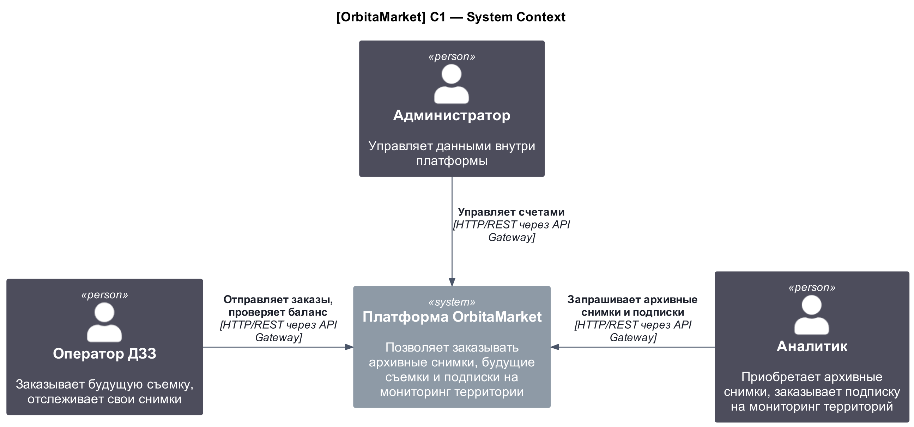
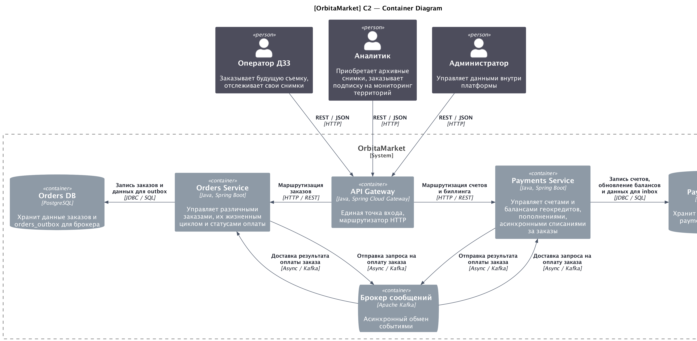
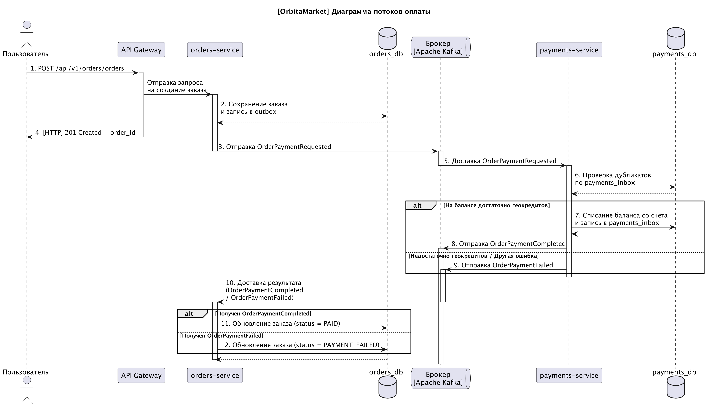
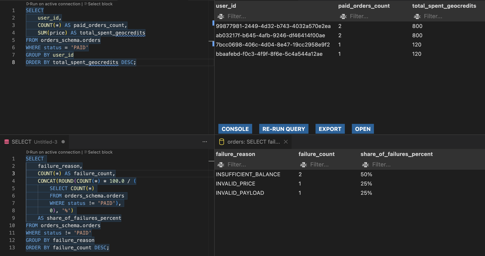

# OrbitaMarket

Учебный проект: платформа для заказа спутниковых продуктов

- [OrbitaMarket](#orbitamarket)
  - [Предметная область](#предметная-область)
  - [Планирование](#планирование)
  - [Архитектура проекта](#архитектура-проекта)
    - [payments-service](#payments-service)
      - [Описание](#описание)
      - [API-запросы](#api-запросы)
      - [База данных](#база-данных)
        - [Таблица `accounts`](#таблица-accounts)
        - [Таблица `payments_inbox`](#таблица-payments_inbox)
      - [Доступ к API](#доступ-к-api)
    - [orders-service](#orders-service)
      - [Описание](#описание-1)
      - [API-запросы](#api-запросы-1)
      - [База данных](#база-данных-1)
        - [Таблица `orders`](#таблица-orders)
        - [Таблица `orders_outbox`](#таблица-orders_outbox)
      - [Доступ к API](#доступ-к-api-1)
    - [gateway](#gateway)
      - [Описание](#описание-2)
      - [Доступ к API](#доступ-к-api-2)
    - [Идентификация пользователей](#идентификация-пользователей)
  - [Сценарии использования](#сценарии-использования)
    - [Пользовательские сценарии](#пользовательские-сценарии)
    - [Технические сценарии](#технические-сценарии)
  - [Тестирование](#тестирование)
  - [Сканирование безопасности](#сканирование-безопасности)
  - [Запуск проекта](#запуск-проекта)
  - [Просмотр аналитики](#просмотр-аналитики)

## Предметная область

Данный проект реализует платформу, которая помогает заказывать цифровые спутниковые продукты. Основные функции системы:

- создание и хранение клиентских счетов и заказов на спутниковые данные;
- автоматическое проведение транзакций внутри системы с использованием геокредитов;
- асинхронный обмен данными между сервисами для обеспечения надежности системы при высоких нагрузках.

Диаграмма контекста в нотации C4:



## Планирование

Планирование разработки платформы до PoC описано в [PROJECT.md](docs/PROJECT.md).

## Архитектура проекта

Проект поделен на несколько модулей:

- payments-service: управление счетами пользователей и проведение транзакций;
- orders-service: управление заказами и транзакционный outbox;
- gateway: сервис-посредник и единая точка входа.

Диаграмма контейнеров в нотации C4:



### payments-service

#### Описание

Выполняет следующие функции:

- прием запросов на создание счетов для пользователей;
- пополнение баланса пользовательских счетов;
- идемпотентная обработка асинхронных списаний средств под конкретные заказы;
- предотвращение гонки данных при списаниях с помощью механизма ретраев оптимистичной блокировки.

#### API-запросы

| Команда | Запрос                              | Возврат         | Примечание                                  |
| ------- | ----------------------------------- | --------------- | ------------------------------------------- |
| POST    | `/api/v1/payments/accounts`         | -               | Создание счета                              |
| POST    | `/api/v1/payments/accounts/top-up`  | -               | Пополнение баланса счета на указанную сумму |
| GET     | `/api/v1/payments/accounts/balance` | JSON метаданных | Получение баланса счета                     |

#### База данных

Для хранения счетов предусмотрена отдельная схема `payments_schema`.

##### Таблица `accounts`

| Атрибут | Тип данных  | Примечание                        |
| ------- | ----------- | --------------------------------- |
| user_id | VARCHAR(64) | ID счета                          |
| balance | INTEGER     | Баланс счета                      |
| version | BIGINT      | Версия баланса (для паттерна CAS) |

##### Таблица `payments_inbox`

| Атрибут       | Тип данных  | Примечание                                    |
| ------------- | ----------- | --------------------------------------------- |
| event_id      | UUID        | ID события в формате UUID                     |
| order_id      | UUID        | ID заказа                                     |
| status        | VARCHAR(20) | Статус оплаты                                 |
| amount        | INTEGER     | Сумма списания                                |
| new_balance   | INTEGER     | Остаток на балансе счета после списания       |
| error_message | TEXT        | Текст сообщения об ошибке (может быть пустым) |
| processed_at  | TIMESTAMP   | Время транзакции                              |

#### Доступ к API

- адрес: http://localhost:8082
- Swagger UI: http://localhost:8082/swagger-ui.html

### orders-service

#### Описание

Выполняет следующие функции:

- прием запросов на создание заказов на приобретение спутниковых продуктов;
- предоставление информации по конкретным заказам;
- асинхронное фоновое чтение и гарантированная публикация сообщений в брокер;
- обработка асинхронных ответов от payments-service.

#### API-запросы

| Команда | Запрос                       | Возврат         | Примечание                                  |
| ------- | ---------------------------- | --------------- | ------------------------------------------- |
| GET     | `/api/v1/orders/orders`      | JSON метаданных | Получение баланса счета                     |
| POST    | `/api/v1/orders/orders`      | -               | Пополнение баланса счета на указанную сумму |
| GET     | `/api/v1/orders/orders/{id}` | JSON метаданных | Получение баланса счета                     |

#### База данных

Для хранения заказов предусмотрена отдельная схема `orders_schema`.

##### Таблица `orders`

| Атрибут        | Тип данных  | Примечание                                                                   |
| -------------- | ----------- | ---------------------------------------------------------------------------- |
| id             | UUID        | ID заказа                                                                    |
| user_id        | VARCHAR(64) | ID счета                                                                     |
| product_type   | VARCHAR(20) | Тип спутникового продукта (ARCHIVE / TASKING / MONITORING )                  |
| payload        | JSONB       | Специализированные параметры продукта                                        |
| price          | INTEGER     | Стоимость                                                                    |
| status         | VARCHAR(20) | Статус заказа (CREATED / PAYMENT_PENDING / PAID / PAYMENT_FAILED / REJECTED) |
| failure_reason | VARCHAR(50) | Причина отмены заказа (если есть)                                            |
| version        | BIGINT      | Версия заказа для контроля конкурентного доступа                             |
| created_at     | TIMESTAMP   | Время создания заказа                                                        |

##### Таблица `orders_outbox`

| Атрибут      | Тип данных  | Примечание                                            |
| ------------ | ----------- | ----------------------------------------------------- |
| event_id     | UUID        | ID события                                            |
| order_id     | UUID        | ID заказа                                             |
| event_type   | VARCHAR(50) | Тип события                                           |
| payload      | JSONB       | Сообщение для брокера после сериализации              |
| status       | VARCHAR(20) | Статус события (PENDING / PROCESSING / SENT / FAILED) |
| retry_count  | INTEGER     | Количество повторных отправок после неудач            |
| created_at   | TIMESTAMP   | Время создания события                                |
| processed_at | TIMESTAMP   | Время отправки события                                |

#### Доступ к API

- адрес: http://localhost:8081
- Swagger UI: http://localhost:8081/swagger-ui.html

### gateway

#### Описание

Выполняет следующие функции:

- перенаправляет запросы между микросервисами по префиксам /api/v1/payments/** и /api/v1/orders/**.
- объединяет Swagger-документацию микросервисов;

#### Доступ к API

- адрес: http://localhost:8080
- Swagger UI: http://localhost:8080/swagger-ui.html

### Идентификация пользователей

Идентификация пользователя происходит на основе HTTP-заголовка `X-User-Id` с типом `String`, который пробрасывается через шлюз во все внутренние микросервисы.

Можно передавать как классический уникальный UUID (например, `99877981-2449-43d2-b743-4032a570e2ea`), так и произвольный текстовый идентификатор (например, `user-42`).

## Сценарии использования

Диаграмма последовательности для сценария оплаты заказа:



### Пользовательские сценарии

Платформа предусматривает следующие пользовательские сценарии:

- Создание и инициализация заказа: пользователь отправляет запрос на покупку спутникового продукта с указанием параметров. Система сохраняет заказ со статусом ожидания оплаты, ставит задачу в очередь и возвращает пользователю ID заказа.
- Пополнение баланса счета: пользователь переводит средства на свой счет, увеличивая доступное количество геокредитов для будущих покупок.
- Просмотр истории заказов: пользователь запрашивает список своих заказов или информацию по конкретному ID, чтобы увидеть статус.

### Технические сценарии

Платформа предусматривает следующие технические сценарии:

- Асинхронное взаимодействие через брокер: после фиксации заказа orders-service отправляет событие `OrderPaymentRequested` в брокер, которое затем асинхронно вычитывается и обрабатывается в payments-service.
- Гарантированная доставка (Transactional Outbox): публикация сообщений в брокер происходит через локальную таблицу `orders_outbox` с помощью фонового шедулера.
- Идемпотентное списание средств (Inbox): сервис платежей фиксирует каждое входящее событие в таблице `payments_inbox`, чтобы баланс не списался дважды при повторной отправке одного и того же сообщения.
- Защита от конкурентной модификации (Optimistic Locking): при одновременном списании средств баланс проверяется и обновляется по механизму CAS (Compare-And-Swap) с ограниченным числом попыток ретраев.
- Обработка бизнес-ошибок: если у пользователя не хватает средств, payments-service генерирует событие `OrderPaymentFailed`, по которому orders-service переводит заказ в финальный статус ошибки и сохраняет причину отказа.

## Тестирование

Тестирование выполнялось с помощью автотестов и Postman. Подробнее в отдельном репозитории: [orbita-market-autotests](https://github.com/YatoroG/orbita-market-autotests.git). В нем лежит исходный код автотестов бэкенда, а также коллекция для Postman и итоговые отчеты Allure.

## Сканирование безопасности

Проект был просканирован на уязвимости в безопасности и утечки чувствительной информации. Результаты можно просмотреть в отчете: [TRIAGE.md](docs/infosec/TRIAGE.md).

## Запуск проекта

Проект можно разворачивать из контейнера с помощью Docker-команды:

```cmd
docker-compose up --build
```

## Просмотр аналитики

Для просмотра аналитики в репозиторий добавлены SQL-запросы. Их можно выполнить после подключения к базам данных через DBeaver / SQLTools в VS Code.

Настройки для подключения к `payments_db`:

| Параметр             | Значение    |
| -------------------- | ----------- |
| Сервер               | localhost   |
| Порт                 | 5432        |
| Название базы данных | payments_db |
| Имя пользователя     | postgres    |
| Пароль               | postgres    |

Настройки для подключения к `orders_db`:

| Параметр             | Значение  |
| -------------------- | --------- |
| Сервер               | localhost |
| Порт                 | 5433      |
| Название базы данных | orders_db |
| Имя пользователя     | postgres  |
| Пароль               | postgres  |

Пример результатов для запросов в `orders_db`:


