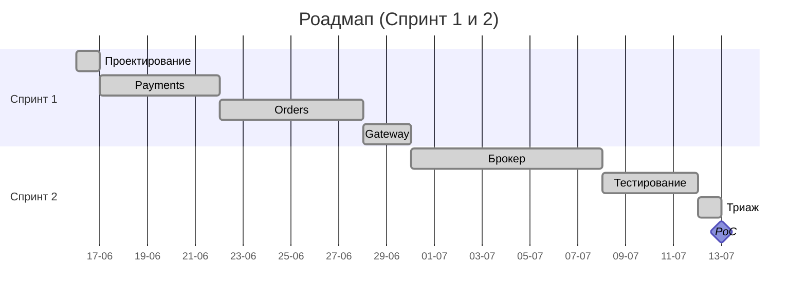
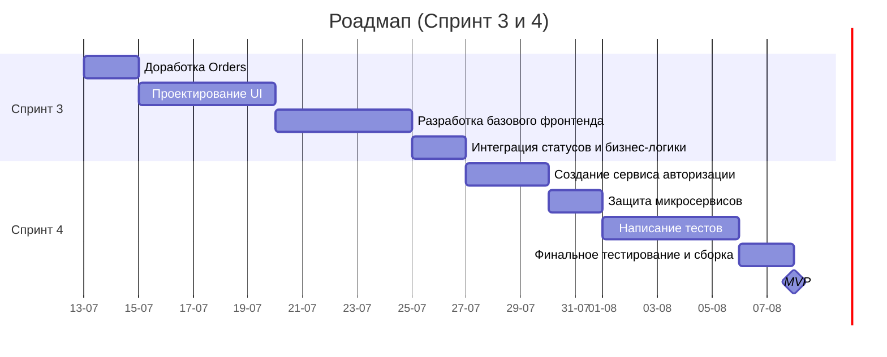

# Планирование проекта OrbitaMarket

## Цель проекта

Разработка отказоустойчивой микросервисной системы для обработки заказов и проведения платежей. Проект должен обеспечивать гарантированную доставку сообщений между сервисами через брокер и мгновенную валидацию некорректных запросов.

## Стейкхолдеры

### Внешние стейкхолдеры

- операторы ДЗЗ;
- аналитические компании;
- клиенты, которым важны геоданные на снимках;
- клиенты-подписчики на мониторинг территории.

### Внутренние стейкхолдеры

- владелец продукта;
- команда разработки;
- инженеры по безопасности.

## Roadmap

Общий срок реализации до PoC: 4 недели (2 спринта по 2 недели).

### Спринт 1: Разработка сервисов

* **Период**: 16.06.2026 — 29.06.2026
* **Этап 1: Проектирование** (неделя 1)
  * Определение цели проекта и стейкхолдеров.
  * Проектирование C4-диаграмм. 
  * Составление роадмапа.
* **Этап 2: Payments** (неделя 1)
  * Проектирование базы данных `payments_schema`.
  * Реализация логики управления счетами пользователей.
* **Этап 3: Orders** (неделя 2)
  * Проектирование базы данных `orders_schema`.
  * Реализация логики управления заказами.
* **Этап 4: Gateway** (неделя 2)
  * Реализация шлюза для взаимодействия обоих сервисов.
  * Настройка Docker и первый запуск.

### Спринт 2: Настройка брокера, тестирование и проверка безопасности
* **Период**: 30.06.2026 — 12.07.2026
* **Этап 5: Брокер** (неделя 3)
  * Конфигурация Apache Kafka в Docker.
  * Реализация паттерна Transactional Outbox через таблицы `orders_outbox` и `payments_inbox`.
  * Асинхронное связывание сервисов: отправка событий на оплату и обработка ответов.
* **Этап 6: Тестирование** (неделя 4)
  * Проектирование сценариев тестирования в Postman.
  * Разработка автотестов бэкенда контроллеров.
  * Проведение тестирования и формирование Allure-отчета.
* **Этап 7: Проверка безопасности** (неделя 4)
  * Сканирование проекта с помощью Gitleaks и Semgrep, триаж находок.
* **Этап 8: PoC** (12.07.2026)
  * Релиз PoC.

## Доработка до MVP

Общий срок реализации до MVP: 4 недели (2 спринта по 2 недели).

### Спринт 3: Доработка Orders и разработка фронтенда

* **Период**: 13.07.2026 — 24.07.2026
* **Этап 1: Доработка Orders** (неделя 1)
  * Добавление других типов спутниковых продуктов.
  * Оптимизация работы платформы под новые типы заказов.
* **Этап 2: Проектирование UI** (неделя 1)
  * Проектирование макетов UI.
  * Разработка контрактов взаимодействия фронтенда с Gateway.
* **Этап 3: Разработка базового фронтенда** (неделя 2)
  * Верстка и интеграция страниц платформы.
* **Этап 4: Интеграция статусов и бизнес-логики** (неделя 2)
  * Связывание фронтенда с механизмом заказов.

### Спринт 4: Добавление авторизации и тестирование нового функционала

* **Период**: 27.07.2026 — 07.08.2026
* **Этап 5: Создание сервиса авторизации** (неделя 3)
  * Разработка регистрации и входа для пользователей.
  * Привязка ID пользователя к его сессии.
* **Этап 6: Защита микросервисов** (неделя 3)
  * Настройка Gateway для проверки прав пользователей.
  * Безопасная передача ID пользователя в сервисы заказов.
* **Этап 7: Написание тестов** (неделя 4)
  * Разработка автотестов фронтенда.
  * Доработка автотестов бэкенда.
  * Доработка сценариев тестирования.
* **Этап 8: Финальное тестирование и сборка** (неделя 4)
  * Тестирование платформы.
  * Поиск и исправление ошибок.
  * Релиз MVP.

