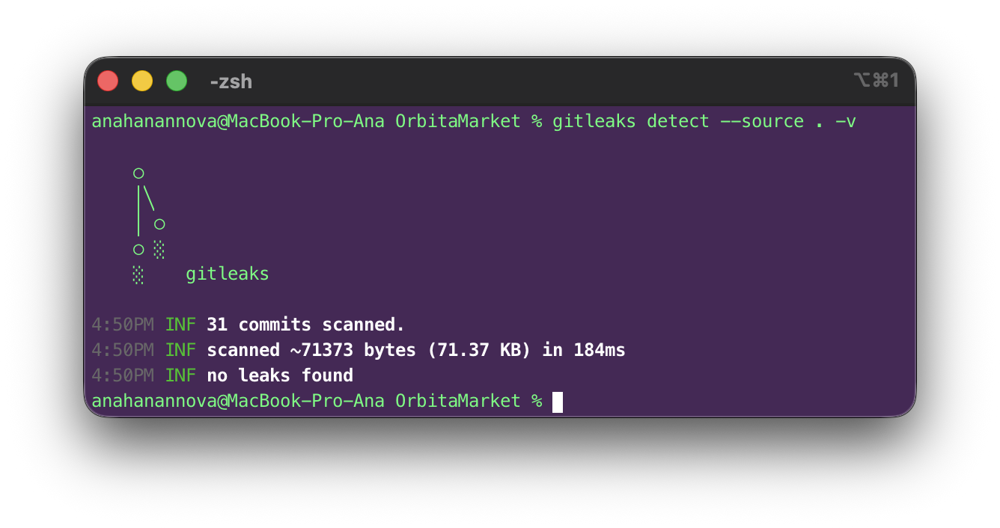
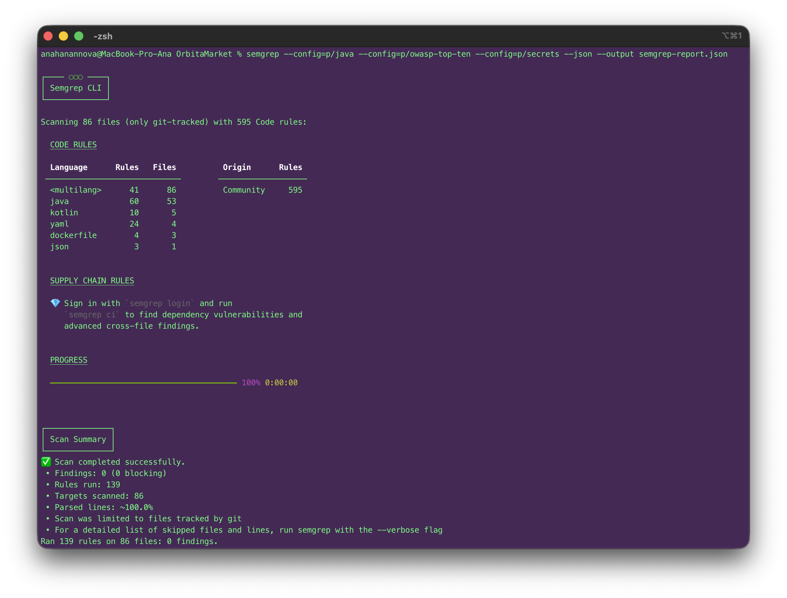
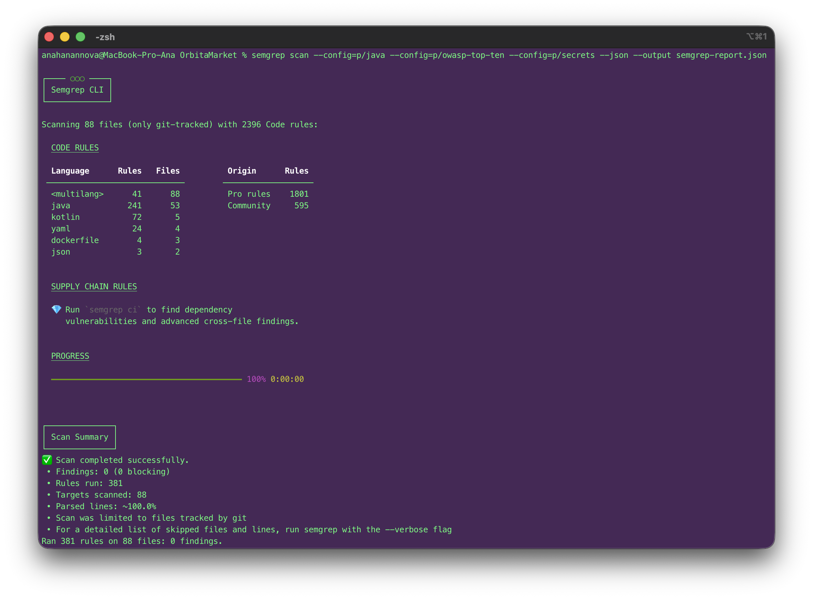

# Информационная безопасность

## Результаты сканирования

### Gitleaks

Сканирование через Gitleaks не выявило нарушений.

В результате сканирования был проверен 31 коммит, утечек секретов не обнаружено.

### Semgrep

Сканирование через Semgrep не выявило нарушений.

Было просканировано 86 файлов с процентом парсинга 100.

После этого был зарегистрирован аккаунт в Semgrep, чтобы получить доступ к большему количеству правил проверки, но сканирование все равно выявило 0 уязвимостей.

## Триаж

Так как сканирование не нашло уязвимостей, таблица триажа будет составлена по «чистому» скану.

|  ID   | Инструмент | Находка                            | Критичность | TP / FP / риск   | Решение                               |
| :---: | ---------- | ---------------------------------- | :---------: | ---------------- | ------------------------------------- |
|   1   | Gitleaks   | Secrets in Git History             |  Critical   | Риск отсутствует | Утечки в истории коммитов отсутствуют |
|   2   | Semgrep    | OWASP Top 10                       |    High     | Риск отсутствует | Уязвимости веб-приложений отсутствуют |
|   3   | Semgrep    | Java Vulnerabilities               |    High     | Риск отсутствует | Баги Java не обнаружены               |
|   4   | Semgrep    | Hardcoded Secrets                  |  Critical   | Риск отсутствует | Зашитые пароли не найдены             |
|   5   | Semgrep    | Dockerfile / YAML Misconfiguration |   Medium    | Риск отсутствует | Ошибки конфигурации не найдены        |
